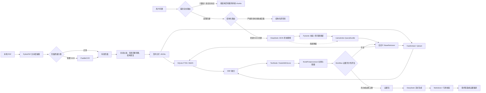

# RAG 实现说明

本文描述仓库当前实际运行的 LlamaIndex RAG 链路，包括 PDF 抽取、清洗与分片、关键词和向量索引、查询理解、双路召回、融合与重排、证据节点、检索反思 Workflow、DeepSeek 生成、流式输出和引用校验。

实现快照日期为 2026-09-11。当前已构建索引的统计来自 2026-09-05 的 `data/reports/*_latest.json` 报告。

## 1. 总体架构

项目有三条问答路径：

1. 明确的 `《篇名》+ 全文/完整原文` 请求，按本地篇目结构直接读取并拼接整篇 chunks。
2. 形式严格的“人物 + 整年/年份区间 + 经历或交集”问题，优先查询结构化研究数据库。
3. 普通历史问题、观点问题、历史时期问题，以及不限定年份的两人交集问题，先由可降级的 LLM 查询理解器生成结构化计划，再进入本文描述的混合 RAG。

已识别的时期问题和不限定年份的交集问题虽然会先经过结构化路由检查，但检查通过后会主动转回混合 RAG。篇目全文与结构化路径不使用向量索引，也不调用 DeepSeek，因此不能把所有聊天回答都理解为 RAG 输出。

“某年之前/以前/之后/以后”属于已经明确的开放边界，不触发“请明确人物和年份”。其中
“1949 年之前”按研究起点至 1948 年解释；带“及”的“1949 年及以前”才包含 1949 年。
双人物的开放边界交集使用确定性查询计划和分阶段混合检索，不依赖查询理解模型猜测边界。



### 1.1 LlamaIndex 框架职责

主 RAG 路径使用 `llama-index-core` 作为基础框架，而不是只在依赖中声明它：

- 查询计划和证据评估的结构化输出由 `PydanticOutputParser` 解析与校验；
- 主查询和扩展查询封装为 `QueryBundle`；
- 关键词与向量融合后端实现为 `BaseRetriever`；
- 每个领域 `SearchHit` 转换为 `TextNode + NodeWithScore`，完整保留文献、页码、章节、年份、人物和原始排序元数据；
- 节点去重、合法性检查和数量限制由 `BaseNodePostprocessor` 执行；
- 首轮检索、充分性判断、定向补充检索和有界停止由 LlamaIndex `Workflow` 及类型化 Event 编排；
- 最终证据回答提示词由 `ChatPromptTemplate` 构造，项目继续使用自己的 DeepSeek HTTP 运行时，以保留连接池、并发准入、请求总预算、供应商 `thinking` 参数和 SSE 故障降级。

框架与领域层之间通过适配器隔离。SQLite FTS5、FastEmbed/Qdrant、RRF、年代覆盖、人物
硬过滤和引用校验没有替换成通用默认实现，因为这些规则是当前评测表现和史料可核验性的
关键。API 响应和健康检查都公开 `rag_framework=llamaindex`，便于运行时确认真实链路。

### 1.2 篇目全文路由

只有问题同时包含书名号篇名和“全文”“完整原文”等明确标记时才进入全文路由。系统先在
`data/processed/structure/*.json` 中精确匹配篇名，再只读取对应文档的 chunk 文件，并按
章节页码、`section_path` 和 `chunk_index` 恢复正文。若存在同名篇目，优先选择问题中明确
提到作者的选集来源；仍无法消歧时要求用户补充作者或文献名，不用零散相似片段冒充全文。

全文响应使用 `retrieval_mode=full_text_section` 和 `generator_mode=extractive`，保留篇目起止
PDF 页码及实际拼接的 chunk 数，不调用查询规划、混合召回或生成模型。正文不会受普通问答
的 Top-K、420 字引文和 5000-token 生成上限影响；网页只在后续对话历史里截断超长答案，
当前轮展示的全文不截断。

离线数据流的核心产物如下：

| 阶段 | 产物 | 默认位置 |
| --- | --- | --- |
| 文本层抽取 | 每页一条 `PageRecord` | `data/processed/pages/*.jsonl` |
| OCR | 需要 OCR 的页面记录 | `data/processed/ocr/*.jsonl` |
| 结构恢复 | PDF 目录或年份章节 | `data/processed/structure/*.json` |
| 分片 | 每个文档一份 chunk JSONL | `data/processed/chunks/*.jsonl` |
| 关键词索引 | SQLite FTS5 数据库 | `data/indexes/keyword_fts.db` |
| 向量索引 | 本地 Qdrant collection | `data/indexes/qdrant/` |
| 嵌入模型缓存 | FastEmbed 模型文件 | `data/models/fastembed/` |

## 2. PDF 抽取和 OCR

### 2.1 文本层抽取

默认解析器是 PyMuPDF。系统逐个物理 PDF 页调用 `page.get_text("text")`，同时统计该页的图片对象数量。某一页的 PyMuPDF 抽取失败时，仅该页回退到 pypdf 的 `page.extract_text()`，并记录 `primary_parser_failed_used_pypdf` 质量标记。也可以通过命令显式选择 pypdf 作为主解析器。

页面阶段只做尽量无损的标准化：

- 把 CRLF 和 CR 统一为 LF；
- 删除 NUL 字符；
- 不在这一阶段合并段落、删除页眉或切分句子。

每个页面记录保存文档 ID、文件 SHA-256、物理 PDF 页码、原始文本、标准化文本、文本 SHA-256、字符数、中文字符数、替换字符数、图片对象数、抽取方法和版本、质量标记、运行 ID 与处理时间。

抽取结果按文件 SHA-256 和抽取器版本复用。状态为 `failed` 的旧记录不会复用；处理中间结果写入 `.partial.jsonl`，每处理 100 页刷新一次，完成后原子替换正式 JSONL。因此中断后可以从已完成页面继续。

### 2.2 页面质量分类

系统先删除空白字符后判断页面内容：

- 无文本且存在图片对象：标记为 `ocr_required`；
- 无文本且无图片对象：标记为 `empty`；
- 少于 50 个非空白字符：保留文本，但添加 `very_short_text`；
- Unicode 替换字符 `U+FFFD` 占比超过 1%：标记为 `ocr_required`；
- 没有中文字符：添加 `no_cjk_characters`，但只要没有严重替换字符，仍可作为已抽取页使用。

语料目录还可把整个文档或指定页面强制标记为需要 OCR。当前目录中同时使用 `partial_required`、`partial_if_needed` 和 `full_required` 策略。

### 2.3 OCR

OCR 使用 PaddleOCR，当前默认参数为：

| 参数 | 当前值 |
| --- | --- |
| PDF 渲染 DPI | 110 |
| 检测模型 | `PP-OCRv5_mobile_det` |
| 识别模型 | `PP-OCRv5_mobile_rec` |
| 推理引擎 | Paddle |
| MKL-DNN | 开启 |
| CPU 线程 | 2 |
| 文档方向分类 | 关闭 |
| 文档去畸变 | 关闭 |
| 文本行方向分类 | 关闭 |

OCR 也按文件 SHA-256 和 OCR 引擎版本复用。构建 chunk 时，页面文本的选择规则是：

1. 文本层记录状态为 `extracted` 且非空时，使用文本层结果；
2. 只有文本层状态为 `ocr_required`，并且对应 OCR 记录状态为 `extracted` 且非空时，才使用 OCR 结果；
3. 不把文本层和 OCR 文本拼接，也不在查询时动态 OCR。

## 3. 页面清洗和结构恢复

### 3.1 目录页过滤

若一个页面前 12 个非空行中出现“目录”，并且至少 3 行包含五个以上连续英文句点或省略号，则整页视为目录页，不参与分片。

### 3.2 重复页眉页脚和页码

系统从每页的前 2 行和后 2 行收集边缘文本。一行满足以下条件时，被视为重复页眉或页脚并从所有页面删除：

- 长度为 2 到 50 个字符；
- 不是纯数字页码行；
- 至少出现在 `max(5, round(总页数 × 4%))` 个页面的页边缘。

由 1 到 4 位数字以及可选空格、横线组成的独立页码行也会删除。这里使用的是 PDF 文本行规则，不会根据版面坐标裁切页面。

### 3.3 段落重建

清洗时先把半角空格、Tab 和全角空格压缩成一个空格，再去掉行首尾空白。普通换行会直接拼接，遇到下列情况结束当前段落：

- 空行；
- 识别到章节、年份或“目录/前言/序言/引言/后记/附录”等标题；
- 行尾是 `。！？；：…）”』】` 中的一个字符。

最终清洗文本用换行分隔重建后的段落。

### 3.4 章节路径

结构恢复有三级回退：

1. PDF 存在书签目录时，使用 PyMuPDF 读取目录层级和起始页；同层或更高层的下一个条目决定当前条目的结束页。
2. 没有 PDF 目录时，识别形如“1937 年（44岁）”的年份标题，每个年份第一次出现的位置成为一级章节起点。
3. 两者都没有时，整个文档使用一个以文献标题命名的根章节。

对每个物理页，系统选取覆盖该页的各级最新章节，形成 `section_path`。章节路径随后参与年份提取、关键词搜索文本和向量嵌入。

## 4. 分片实现

当前分片器版本是 `page-sentence-chunker-v1`，清洗器版本是 `page-cleaner-v1`。

### 4.1 分片边界和长度

分片严格限制在单个物理 PDF 页内，不跨页，也没有重叠窗口。默认参数为：

| 参数 | 值 | 含义 |
| --- | ---: | --- |
| `target_chars` | 650 字符 | 缓冲区达到该长度后优先输出 |
| `max_chars` | 900 字符 | 单个 chunk 的硬上限 |
| 最短 chunk | 20 字符 | 更短内容丢弃 |
| 尾段合并阈值 | 80 字符 | 小尾段在不超过 900 字符时并入前一块 |
| overlap | 0 | 当前没有重叠 |

具体算法如下：

1. 按清洗后的换行取得段落。
2. 在 `。！？；` 后切成句子单元。
3. 顺序把句子加入缓冲区；若加入后会超过 900 字符，先输出旧缓冲区。
4. 缓冲区达到 650 字符后立即输出，因此常见 chunk 接近 650 到 900 字符。
5. 单个句子超过 900 字符时，直接按每 900 字符硬切。
6. 页尾剩余内容少于 80 字符，并且与前一块合并后不超过 900 字符时，合并到前一块。
7. 删除不足 20 字符的块。

650 是目标值而不是下限。页面末尾、标题和短页仍会产生短于 650 字符的有效 chunk。

### 4.2 Chunk 标识和相邻关系

`chunk_id` 根据以下内容计算两次 SHA-256，最终保留 32 个十六进制字符：

```text
document_id:file_sha256:pdf_page:page_chunk_index:cleaner_version:chunker_version:content_hash
```

其中 `content_hash` 是清洗后 chunk 文本的完整 SHA-256。Qdrant 点 ID 直接把 32 位 `chunk_id` 转成 UUID。

每个 chunk 记录同一文档中的 `previous_chunk_id` 和 `next_chunk_id`。当前在线召回不会根据这些字段扩展相邻 chunk，它们只是为后续上下文扩展保留。

### 4.3 时间和人物元数据

时间抽取支持：

- `18xx`、`19xx`、`20xx` 年，可带阿拉伯数字月、日；
- 由 `〇○零一二三四五六七八九` 组成的四位中文年份。

chunk 正文和章节路径中的年份、日期会合并为 `year_mentions` 与 `date_mentions`。研究范围默认是 1921—1978 年，系统据此给 chunk 标记：

- `in_scope`：所有用于判定的年份都在范围内；
- `out_of_scope`：全部在范围外；
- `mixed`：范围内外年份同时出现；
- `unknown`：没有识别到年份。

对 `chronology` 年谱类文献，如果章节路径恰好只有一个年份，则用章节年份判定范围，避免正文中提到其他年份导致误判；其他文献使用正文与章节合并后的全部年份。

人物识别读取 `config/person_aliases.json`。只要规范名或任一别名作为字面字符串出现在 chunk 正文中，就写入规范人物名。这里没有命名实体识别模型，也没有上下文消歧模型。

### 4.4 Chunk 字段和搜索文本

主要字段包括：

- 文档：`document_id`、标题、文件名、作者/编者、来源类型、版次、卷次、核验状态、文件 SHA-256；
- 位置：文档内 chunk 序号、页内序号、PDF 物理页、可选印刷页、章节路径；
- 内容：正文、字符数、内容哈希、清洗器和分片器版本；
- 语义元数据：年份、日期、研究范围状态、人物、抽取方法；
- 链接：前一个和后一个 chunk ID。

关键词索引使用的 `search_text` 为：

```text
chunk正文 + 文献标题 + section_path + 规范人物名 + “YYYY年”
```

向量索引使用另一份输入，见第 6 节。

## 5. 关键词索引：SQLite FTS5 + BM25

### 5.1 索引结构

关键词索引版本为 `sqlite-fts5-cjk-bigram-v1`。SQLite 中有两个主要结构：

- `chunk_metadata` 普通表：保存文档、页码、章节、正文、年份、人物、范围状态等完整元数据；
- `chunk_fts` FTS5 虚拟表：保存不参与搜索的 `chunk_id` 和预分词后的 `terms`。

FTS5 的底层 tokenizer 是 `unicode61 remove_diacritics 2`。中文切词由应用层预先完成，不依赖 SQLite 的中文分词能力。

构建时先写临时数据库，关闭 journal 和同步写以提高批量导入速度，完成后运行 `PRAGMA integrity_check`。只有结果为 `ok` 才会原子替换正式索引。

### 5.2 中文和非中文分词

对连续中文字符使用相邻二元字 bigram。例如：

```text
抗日战争 -> 抗日 / 日战 / 战争
```

长度为 1 或 2 的中文串保持原样。英文、数字及包含连字符或下划线的英文标识使用正则提取并转为小写。四位年份还会显式加入 `YYYY` 和 `YYYY年` 两个 token。

查询端使用相同 tokenizer，然后：

- 删除“哪些、什么、怎么、如何、主要、请问、经历、观点、交集、期间”等停用词；
- 删除以“的、了、在、和、与、及、是、有、为、于、把、被、从、对”等虚词开头或结尾的中文 token；
- 去重；
- 没有剩余可检索 token 时直接报检索错误。

最终 FTS 表达式是所有 token 的精确短语 OR：

```text
"毛泽" OR "泽东" OR "抗日" OR "日战" OR "战争" ...
```

因此关键词召回本身偏宽，不要求所有词同时出现；人物、年份和研究范围由元数据过滤补充约束。

### 5.3 BM25 排名和来源偏置

SQLite `bm25(chunk_fts)` 的原始值越小越靠前。系统在排序表达式中减去以下奖励值：

| 条件 | BM25 排序奖励 |
| --- | ---: |
| 时间线问题命中 `chronology` | 4.0 |
| 观点问题命中 `selected_works` | 4.0 |
| 查询人物出现在文献 `creators` | 2.0 |

返回给上层的关键词 `score` 是调整后 `raw_score` 的相反数，并保留 6 位小数。混合融合阶段只使用关键词排名，不使用这个分数的绝对大小。

## 6. 向量索引：FastEmbed + Qdrant

### 6.1 文本嵌入模型

当前模型和索引参数为：

| 项目 | 当前值 |
| --- | --- |
| 嵌入模型 | `BAAI/bge-small-zh-v1.5` |
| 向量维度 | 512 |
| 相似度 | Cosine |
| 推理库 | FastEmbed |
| 模型线程数 | `min(8, CPU逻辑核数)`，最少 1 |
| 建库 batch size | 64，可通过 CLI 调整到 1—512 |
| 向量库 | Qdrant 本地模式 |
| collection | `history_chunks` |

文档侧嵌入输入为：

```text
文献标题
章节1 > 章节2 > ...
chunk正文
```

它不使用关键词索引中的完整 `search_text`，不会额外拼接人物规范名和合成年份；但标题与章节会进入嵌入文本。查询侧调用 FastEmbed 的 `query_embed(query)`，文档侧调用 `embed(...)`。

### 6.2 Qdrant payload 和原子构建

每个向量点同时保存 chunk ID、文档元数据、页码、章节、正文、年份、人物、范围状态和抽取方法，便于在 Qdrant 内过滤并直接还原 `SearchHit`。

构建时创建临时 Qdrant 目录，分批 upsert，最后执行精确计数；点数必须等于 chunk 数。成功后先备份旧目录，再原子替换；替换失败会恢复备份。

### 6.3 向量候选排序

普通查询直接按 Qdrant 的余弦相似度取候选。只有“明确年份 + timeline 意图”的问题会扩充候选池：

```text
candidate_limit = min(500, max(100, top_k × 20))
```

系统随后把章节路径包含目标年份的候选放到正文偶然提及该年份的候选之前，再截取向量分支自己的 `top_k`。这个规则只用于明确年份的时间线问题，不用于历史时期或普通观点问题。

## 7. 查询理解和过滤

形式严格的结构化问题不调用模型。其他自由问法在混合检索前默认调用 `deepseek-v4-flash` 非思考模式，要求以 JSON 输出：规范问题、意图、实体及其规范名、起止年份、覆盖方式、不可丢弃的约束、是否需要澄清，以及最多 4 条短检索表达式。模型只负责理解问题，不回答历史事实，也不会收到本地史料。

计划必须通过本地 Pydantic schema、年份完整性和澄清问题校验。有效计划的规范问题、检索表达式、实体规范名和意图提示会追加到检索串；用户原问题始终原样放在最前面，因此月份、地点、否定、比较对象和来源限制不会因模型改写而从检索输入中消失。模型未配置、关闭、超时、限流或返回非法计划时，系统直接使用原问题走现有规则式解析。关键词和向量分支仍共享这套确定性解析，作为执行层和离线降级路径。

### 7.1 意图识别

规则按以下顺序判断，先匹配者生效：

| 意图 | 触发词示例 |
| --- | --- |
| `intersection` | 交集、共同、一起、关系 |
| `observation` | 记述、描述 |
| `viewpoint` | 观点、论述、主张、看法、如何看、怎样分析、谋划、战略、方针、策略 |
| `timeline` | 问题含年份或已知时期，同时含经历、做了什么、活动、任职、担任、职务、主要做 |
| `general` | 以上均未匹配 |

观察类问题仍会在包含“怎样记述、如何记述、怎样描述、如何描述”时追加“外貌 性格 生活 印象”。查询计划还会按已校验意图追加少量检索提示词，例如 timeline 的“经历、活动、时间线”和 viewpoint 的“观点、论述、主张、策略”；项目不使用 HyDE，查询理解器不得生成历史事实作为伪文档。

### 7.2 历史时期映射

当前内置映射为：

| 时期 | 召回年份范围 |
| --- | --- |
| 长征 | 1934—1936 |
| 抗日战争、全面抗战 | 1937—1945 |
| 解放战争 | 1945—1949 |
| 抗美援朝 | 1950—1953 |
| 大跃进 | 1958—1960 |
| 文化大革命、文革 | 1966—1976 |

问题中有明确四位年份时，以最小和最大年份构成 `query_year_range`；没有明确年份时才使用时期映射。时期年份只用于召回与覆盖控制，不代表片段中的事件一定属于该时期。

### 7.3 人物过滤

查询人物同样通过规范名和别名字面匹配得到。对 `intersection`、`timeline` 和 `general` 意图，所有识别到的人物都必须出现在 chunk 的 `people` 数组中。

`viewpoint` 和 `observation` 不做人物硬过滤，因为人物自己的文选正文常常不重复作者姓名。这两类问题依靠标题、向量语义、文献作者和来源类型的排序奖励把相关文选排在前面。

### 7.4 年份和范围过滤

默认排除 `scope_status = out_of_scope`，但保留 `in_scope`、`mixed` 和 `unknown`。CLI 可以显式要求包含范围外内容。

关键词和向量分支在明确多个年份时有一处实现差异：

- 关键词分支要求 chunk 至少包含任一明确年份。例如问题写“1937 到 1945”，关键词候选须包含 1937 或 1945；
- 向量分支用最小值到最大值做连续范围过滤，1937—1945 中任一年都可命中；
- 使用“抗日战争”这类时期名时，两条分支都会按连续范围过滤。

年份来自正文与章节路径，属于基于提及的过滤。它不能区分“当前事件发生年份”和“正文回顾的其他年份”。

## 8. 双路召回、融合和重排

### 8.1 候选 Top-K

混合检索先为每条分支计算候选数：

```text
candidate_k = min(100, max(30, final_top_k × 4))
```

网页问答的基础 `final_top_k` 固定提交 12；复杂覆盖计划会把内部证据预算扩展到
24—36 条，因此下面的 48 条候选池是普通问题的基准值：

- 关键词分支最多返回 48 个候选；
- 向量分支最多返回 48 个候选；
- 合并前最多有 96 个不同 chunk，实际会因两路重合而更少；
- 最终最多保留 12 个证据 chunk。

当前两条分支在后端顺序执行，尚未并行。

### 8.2 Reciprocal Rank Fusion

两路结果通过 RRF 融合，常数 `K = 60`。某个 chunk 的基础融合分数为：

```text
RRF(chunk) = [若有关键词排名则 1 / (60 + keyword_rank)]
           + [若有向量排名则 1 / (60 + vector_rank)]
```

这意味着两路同时命中的 chunk 通常显著优于只在一路命中的 chunk。RRF 只看各分支的名次，不直接比较 BM25 与余弦分数。

### 8.3 混合层来源奖励

RRF 后再按查询意图增加 0.004：

| 条件 | RRF 奖励 |
| --- | ---: |
| 时间线问题，且查询人物出现在文献标题 | 0.004 |
| 无人物的时间线问题命中 `chronology` | 0.004 |
| 观点问题命中 `selected_works` | 0.004 |
| 观察描述问题命中 `contemporary_observation` | 0.004 |

随后按融合分数降序排列；同分时先按 PDF 页码，再按 chunk ID 排序。

### 8.4 按物理页去重

一个 PDF 页可能产生多个相邻 chunk。融合排序后，系统按 `(document_id, pdf_page_start)` 去重，每个物理页只保留排名最高的一个 chunk，以减少回答证据的重复页。

### 8.5 跨时期覆盖选择

当查询范围至少 5 年、最终 `top_k >= 3`，并且问题没有“初期、前期、早期、中期、后期、晚期、末期”等聚焦词时，系统会做时间覆盖选择。

处理过程：

1. 从命中年份中选取查询范围内的主年份。优先取正文中最早直接出现的 `YYYY年`；正文没有直接格式时取最小年份。
2. 把查询起止年份的闭区间等分成 3 个桶。
3. 每桶先选 `max(1, top_k // 3)` 个原始高排名结果。
4. 桶内不足时，再按原始相关性排名补足到 `top_k`。
5. 最终展示顺序仍保持原始相关性顺序，不强制改成时间顺序。

网页默认 `top_k = 12`，所以目标配额是每个时间桶 4 条。例如“毛泽东对抗日战争的谋划”会被识别为 `viewpoint`，映射到 1937—1945，并尝试覆盖 1937—1939、1940—1942、1943—1945 三段。某一段没有足够候选时，不能保证严格的 4/4/4。

当前所谓“重排”由 BM25/向量分支内部排序、RRF、规则来源奖励、按页去重和时间覆盖选择组成。项目没有 cross-encoder、LLM reranker 或其他学习式重排模型。

职务变化类问题另有一道确定性相关性门槛：候选片段必须在同一短句中把问题人物与
书记、常委、委员等具体职务及任免/组成关系直接关联。仅仅提到人物、转发其报告，或在
长段落远处出现其他人的职务，不会进入最终证据包；“党内职务”还会排除单纯的军事任命。

## 9. Top-K 全链路

| 环节 | 网页当前值 | 说明 |
| --- | ---: | --- |
| 请求 `QuestionRequest.top_k` | 12 | 合法范围 1—12 |
| 关键词候选 | 48 | `max(30, 12×4)` |
| 向量候选 | 48 | 普通查询；明确年份时间线会在 Qdrant 内先取更宽池再截为 48 |
| RRF 后最终命中 | 普通问题最多 12；复杂问题最多 36 | 已经过按页去重、意图过滤与覆盖选择 |
| 发送给模型的证据 | 与内部最终命中相同 | 超过 12 条时使用分组摘要和最终综合 |
| API 最终返回引用 | 不超过模型证据数 | 只保留最终答案实际使用的 `[E#]`；`retrieved_evidence_count` 记录内部候选数 |
| 单条证据引文 | 最多 420 字符 | 从 chunk 中裁切 |
| 生成失败时的摘录条目 | 最多 5 | 即使召回 12 条，降级回答正文也只摘要前 5 条 |
| DeepSeek 输出上限 | 5000 tokens | 是最大生成量，不是目标长度或最短长度 |

因此，“网页提交 `top_k=12`”不等于系统总是召回或展示 12 条。复杂问题可扩大内部
证据预算；最终引用只显示答案实际采用的证据；生成彻底失败时，摘录正文固定只使用前
5 条证据。

## 10. 证据构造

### 10.1 是否允许生成回答

混合检索完成后还要经过证据门槛：

- 最终命中中至少有一条必须来自关键词分支；只有向量近似命中时，不向模型提供证据；
- 对形如“某人在 1949 年……”的开头实体，若所有命中标题、正文和章节都没有出现该实体，则判为不支持；
- 门槛不通过时，引用列表为空，系统不调用 DeepSeek，也不会用纯语义近似结果强行作答。

门槛通过后，最终命中按当前顺序编号为 `E1`、`E2`……，所有选中的命中都会进入模型
证据包，包括只在向量分支出现的命中。模型回答完成并通过引用校验后，API 的 `citations`
只返回答案正文实际出现的编号；未采用候选不在页面展示，其总数保留在
`retrieved_evidence_count` 诊断字段中。

`evidence_status` 的计算规则是：

- 非交集问题，且前 5 条中至少一条同时被关键词和向量命中：`supported`；
- 其他有证据情况，包括所有交集问题：`partial`；
- 没有通过证据门槛：`no_evidence`。

这个状态表达检索支持强度，不代表史实已经人工核验。

### 10.2 引文裁切

每条证据引文最多 420 字符：

- chunk 不超过 420 字符时使用全文；
- 普通问题围绕最早出现的查询词，尽量从前一个句末开始截取；
- 单人物时间线问题优先从该人物所在句开始，避免同页前文成为摘录摘要；
- 恰好识别到两个人的交集问题，优先寻找 420 字符范围内距离最近的两个人名，并保留其前方事件上下文；
- 截断处用省略号标示。

人物接近只用于选择展示窗口，不能证明两人发生互动。

模型收到的证据格式为：

```text
[E1] 《文献标题》PDF第123页；章节：一级章节 > 二级章节
最多420字符的原文片段
```

## 11. DeepSeek 生成、流式传输和 Markdown

### 11.1 生成参数

当前默认配置为：

| 参数 | 当前值 |
| --- | --- |
| Provider | DeepSeek 兼容 Chat Completions API |
| URL | `{llm_base_url}/chat/completions` |
| 模型 | `deepseek-v4-pro` |
| thinking | 关闭 |
| reasoning effort | `high`，仅 thinking 开启时发送 |
| `max_tokens` | 5000 |
| 超时 | 120 秒 |
| 输入历史 | 后端最多使用最近 6 条消息 |

查询理解器默认使用 `deepseek-v4-flash`、关闭 thinking、JSON Output、`max_tokens=700`、超时 20 秒，同样最多读取最近 6 条消息。API 最终结果通过 `query_plan`、`query_planner_status`、`query_planner_model`、`query_planner_usage` 和 `query_planner_error_code` 暴露规划结果与诊断；答案生成的用量仍单独记录在 `llm_usage`。

网页每次提交最近 8 条历史消息，请求模型允许最多 12 条；真正构建 DeepSeek prompt 时再截取最后 6 条。

系统提示词要求模型：

- 只能使用证据包，不能用模型记忆补充事实；
- 每个日期、职务、地点、行动、会议决定和人物关系等事实在同一段或列表项标注 `[E#]`；
- 区分原文观点、年谱记载和后人叙述；
- 交集问题不能把人名共现推断为互动；
- 长时期问题应覆盖多个阶段，缺材料的阶段要明确说明；
- 使用 Markdown 组织答案。

### 11.2 流式输出

网页调用 `POST /api/questions/stream`，后端以 Server-Sent Events 返回：

- `status`：检索、生成、核查、后台补引用等阶段状态；
- `delta`：DeepSeek 第一版回答的增量文本；
- `done`：经过引用核查的权威最终 `AnswerResponse`；
- `error`：检索或服务异常。

当前引用修复的第二次模型输出在后台完成，不重新流式展示，也不清空第一版草稿。收到 `done` 后，前端用最终答案整体替换生成中的草稿，因此最终文本仍可能因修复、删段或降级而变短或发生变化。

前端用 Marked 按 GFM 和换行模式解析 Markdown，再用 DOMPurify 白名单清洗。支持标题、粗体、斜体、删除线、列表、引用、代码块、链接和表格；链接只保留 `http`、`https` 和 `mailto` 协议。

## 12. 引用校验、修复和降级

### 12.1 校验内容

后端使用 `markdown-it-py` 按 CommonMark 和表格语法解析答案，将段落、标题、列表项、引用和表格行作为事实块。校验包括：

1. 回答中必须出现至少一个 `[E#]`；
2. 所有证据编号必须存在于本次证据包；
3. 含日期、任职、参加、会见、领导、提出、决定、召开、行动、人物关系等信号的事实块必须在同一块内有引用；
4. 如果模型写出“《文献》PDF 第 N 页”，该块的证据编号必须与实际文献名和页码匹配；
5. 单独一行的引用只归属于同一容器中紧邻的上一段，不能跨列表项借用；
6. 单纯说明“现有证据不足以确认……”的限制语句通常不要求引用，但其中夹带新的事实断言时仍会校验。

校验器检查引用格式、覆盖位置和文献/页码元数据，不做语义蕴含判断。也就是说，它不能判断 `[E1]` 的原文是否真正证明挂靠在它前面的结论。

### 12.2 一次修复和安全删段

第一版回答出现 `uncited_core_claim` 时，系统会：

1. 尝试按 Markdown 源码行删除缺少引用的事实块；
2. 对删段后的答案重新完整校验，只有再次通过才保留为安全候选；
3. 把第一版答案和缺引用语句发回 DeepSeek，要求只修引用或删除无证据事实；
4. 校验修复版；
5. 如果删段版和修复版都有效，选择文本更长的版本。

修复只尝试一次。无效证据编号、文献/页码不匹配、流中断、超时、鉴权失败、token 用尽等错误不会无限重试。

### 12.3 证据摘录降级

没有可用的合成答案时，系统退回确定性的证据摘录：从前 5 条 citation 中各取第一句可用内容，单条最多 180 字符，并保留 `[E#]`。

所以界面出现“DeepSeek 生成未通过……已安全降级为证据摘录”时，RAG 召回通常已经成功，失败发生在生成或引用校验阶段。降级回答比 12 条召回结果短是当前明确的实现行为。

## 13. 当前索引规模

2026-09-05 最新构建报告记录：

| 指标 | 当前值 |
| --- | ---: |
| 文献数 | 16 |
| 有效 PDF 页 | 15,911 |
| 跳过页 | 33 |
| 结构条目 | 1,275 |
| chunk 数 | 24,036 |
| chunk 总字符数 | 12,987,963 |
| 关键词索引大小 | 233,000,960 bytes，约 222.2 MiB |
| 向量索引大小 | 198,001,200 bytes，约 188.8 MiB |
| FastEmbed 版本 | 0.8.0 |
| qdrant-client 版本 | 1.19.0 |

当前 Qdrant 使用本地嵌入式模式，点数已经超过其运行时提示的 20,000 点建议阈值。它仍可运行，但随着语料增长，索引打开、查询并发和进程互斥会成为需要关注的工程限制。

## 14. 构建、调试和验证命令

完整重建顺序：

```powershell
uv run history-agent corpus scan
uv run history-agent extract text
uv run history-agent extract ocr
uv run history-agent extract report
uv run history-agent process chunks
uv run history-agent index build-keyword
uv run history-agent index build-vector
```

只重做指定文献的抽取或分片：

```powershell
uv run history-agent extract text --document-id mao_zedong_chronology_volume_2 --rebuild
uv run history-agent extract ocr --document-id mao_zedong_chronology_volume_2 --rebuild
uv run history-agent process chunks --document-id mao_zedong_chronology_volume_2
```

关键词和向量索引构建命令总是读取 `data/processed/chunks/` 下的全部 JSONL。局部分片更新后，需要重新构建两个索引，线上查询才会同时看到一致的数据。

分别调试三种检索：

```powershell
uv run history-agent search "毛泽东对抗日战争的谋划" --top-k 12
uv run history-agent search-vector "毛泽东对抗日战争的谋划" --top-k 12
uv run history-agent search-hybrid "毛泽东对抗日战争的谋划" --top-k 12
```

运行回归检查：

```powershell
& .\scripts\check.ps1
uv run history-agent eval retrieval --top-k 10
uv run history-agent eval answers --top-k 10
```

## 15. 主要边界和改进方向

当前实现的主要边界如下：

1. **无重叠且不扩邻居。** 分片保持页码精确、证据简洁，但跨 chunk 的上下文容易丢失。已经保存相邻 ID，却未用于召回后的上下文扩展。
2. **页内分片。** 一个事件跨 PDF 页时，不会形成同一个 chunk；按页去重还会使同页的第二个相关片段退出最终证据。
3. **年份是提及，不是事件时间。** 章节年份能改善年谱，但普通文献中的回顾、比较和注释仍可能造成时间误归属。
4. **人物识别是字面规则。** 别名表以外的称呼会漏检；同名、简称和 OCR 错字没有语义消歧。
5. **FTS 是 bigram OR 查询。** 召回较宽，长问题中的弱相关 bigram 也可能带来候选；人物和年份硬过滤能缓解，但不能完全消除。
6. **两路过滤并不完全对称。** 明确多个年份时，关键词取边界年份 OR，向量取连续范围，融合结果可能表现不同。
7. **没有学习式重排。** 当前规则适合透明调试，但无法像 cross-encoder 那样联合判断“问题—证据”相关性。
8. **时间覆盖依赖主年份启发式。** 选择更均衡，但正文最早出现的年份不一定是片段主事件年份；缺少某阶段候选时也无法凭空补足。
9. **证据引文最多 420 字符。** 模型看不到完整 chunk 的全部上下文；扩大检索条数与扩大单条上下文是两个不同调参方向。
10. **引用校验不是事实蕴含校验。** 它能拦截缺引用、非法编号和错误页码，不能证明结论与原文语义一致。
11. **生成长度受多层影响。** 5000 tokens 只是模型上限；模型提前停止、修复删段和最多 5 条的摘录降级都会缩短最终答案。
12. **本地 Qdrant 已超过 20,000 点。** 后续明显扩库时，宜评估独立 Qdrant 服务或其他可并发的持久化向量服务。

若要继续改善长时期问题，优先级通常应是：先评估分时期召回是否命中，再增加候选池或按时间子查询，随后考虑邻居扩展和 cross-encoder 重排。单纯不断增大 chunk，会把更多无关事件、人物和年份塞进同一证据，可能降低页码级可核验性。

## 16. 代码位置

| 功能 | 实现文件 |
| --- | --- |
| 配置与路径 | `app/history_agent/config.py` |
| 文本层质量分类 | `app/history_agent/extraction/text.py` |
| 全量文本抽取与复用 | `app/history_agent/extraction/full.py` |
| PaddleOCR | `app/history_agent/extraction/ocr.py` |
| 页面清洗 | `app/history_agent/processing/cleaning.py` |
| 章节结构恢复 | `app/history_agent/processing/structure.py` |
| 分片和元数据 | `app/history_agent/processing/chunks.py` |
| 关键词索引与查询解析 | `app/history_agent/retrieval/keyword.py` |
| LLM 查询理解与安全降级 | `app/history_agent/answering/query_understanding.py` |
| 向量索引与召回 | `app/history_agent/retrieval/vector.py` |
| RRF、按页去重、时间覆盖 | `app/history_agent/retrieval/hybrid.py` |
| 篇目全文读取与拼接 | `app/history_agent/answering/full_text.py` |
| 证据构造与同步生成 | `app/history_agent/answering/service.py` |
| 流式生成与修复 | `app/history_agent/answering/streaming.py` |
| 引用校验与删段 | `app/history_agent/answering/validation.py` |
| 结构化问答路由 | `app/history_agent/answering/structured.py` |
| Web API | `app/history_agent/web/app.py` |
| 前端流式与 Markdown | `app/history_agent/web/static/app.js`、`markdown.js` |
