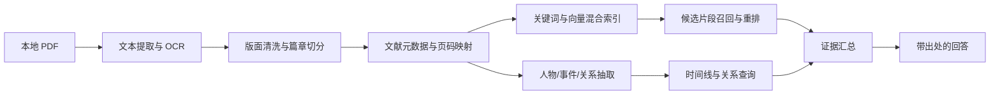

# 近现代史研究 Agent（1921—1978）

一个面向中国近现代史学习与研究的本地知识库 Agent。项目以 1921—1978 年为时间边界，以中国共产党历史为主线，围绕毛泽东、周恩来、邓小平、林彪等关键人物组织史料，提供带原文出处的问答、时间线梳理、人物交集分析和观点检索。

项目不是让大模型凭记忆讲历史，而是要求它先检索本地文献，再依据检索到的材料回答；所有重要结论都应能追溯到具体文献和 PDF 页码。

## 项目文档

- [需求分析](REQUIREMENTS.md)：定义用户场景、功能需求、非功能需求、验收标准和 MVP 边界。
- [任务规划](TASK_PLAN.md)：将需求拆分为里程碑、具体任务、依赖关系、交付物和质量闸门。
- [结构化研究模型](RESEARCH_SCHEMA.md)：说明人物、事件、关系、时间精度、证据和人工复核约束。
- [年谱抽取基线](evals/CHRONOLOGY_BASELINE.md)：记录首批规则抽取规模、人工页码抽查与已知限制。

## 快速启动

### 1. 准备环境

- Python 3.11 或更高版本；
- [uv](https://docs.astral.sh/uv/)；
- DeepSeek API Key（可选；不配置时使用本地证据摘录模式）；
- 本项目登记的 PDF 史料。PDF 和生成索引不随 Git 仓库分发。

```powershell
git clone git@github.com:bibofu/history-agent.git
cd history-agent

# 创建虚拟环境并安装 OCR、向量检索、Web 和开发依赖
uv sync --extra ocr --extra vector --extra app --group dev
```

### 2. 配置 DeepSeek V4

Windows PowerShell：

```powershell
Copy-Item .env.example .env
```

macOS/Linux：

```bash
cp .env.example .env
```

编辑 `.env`，填写：

```dotenv
DEEPSEEK_API_KEY=你的密钥
```

默认使用 `deepseek-v4-pro` 非思考模式。确认配置且不显示密钥：

```powershell
uv run history-agent llm status
uv run history-agent llm check
```

### 3. 放入史料并首次建库

将 PDF 放入 `docs/`。文件名应与 `config/corpus_catalog.json` 中登记的名称一致，然后执行：

```powershell
# 登记文献并提取全部页面
uv run history-agent corpus scan
uv run history-agent extract text

# OCR 扫描页并生成质量报告
uv run history-agent extract ocr
uv run history-agent extract report

# 清洗、切分并建立双索引
uv run history-agent process chunks
uv run history-agent index build-keyword
uv run history-agent index build-vector

# 初始化研究表，从周、林年谱及毛泽东年谱九卷生成带页码证据的事件候选
uv run history-agent research init
uv run history-agent research extract-chronologies

# 只预览待模型处理的复杂/低置信度事件，不调用 DeepSeek
uv run history-agent research enrich-events --dry-run --limit 5

# 预览跨来源重复事件；确认规则输出后去重并保留全部来源证据
uv run history-agent research merge-events --dry-run --json
uv run history-agent research merge-events
```

首次 OCR 和向量索引构建耗时较长，并会下载 PaddleOCR 与中文嵌入模型；任务支持复用已完成的页面结果。生成内容位于 `data/`，不会提交到 Git。

### 4. 启动问答页面

完成首次建库后，日常启动只需要：

```powershell
uv run history-agent serve
```

浏览器打开 [http://127.0.0.1:8000](http://127.0.0.1:8000)。停止服务按 `Ctrl+C`。如果修改了 `.env`，需要重启服务才能读取新配置。

### 5. 启动检查与常见状态

```powershell
# 检查文献目录、数据库和研究时间边界
uv run history-agent health --json

# 检查 DeepSeek 配置与真实连通性
uv run history-agent llm status
uv run history-agent llm check

# 执行代码质量检查和测试
& .\scripts\check.ps1
```

- 页面显示“DeepSeek 密钥未配置”：检查 `.env` 中的 `DEEPSEEK_API_KEY`，然后重启服务。
- 页面显示索引未就绪：完成“首次建库”中的 `process chunks` 和两个 `index build-*` 命令。
- DeepSeek 调用失败：系统会保留本地检索结果并自动降级为证据摘录，不会凭模型记忆补写。

## 完整维护命令

以下命令用于文献更新、索引调试和评估。在 Windows PowerShell 中运行：

```powershell
# 创建虚拟环境；OCR、向量检索和 Web 界面均安装到本地环境
uv sync --extra ocr --extra vector --extra app --group dev

# 检查环境和研究时间边界
.\.venv\Scripts\history-agent.exe health --json

# 扫描 docs/，更新文献数据库并导出清单和差异报告
.\.venv\Scripts\history-agent.exe corpus scan

# 初始化人物主数据、别名和关系词表（幂等，可重复执行）
.\.venv\Scripts\history-agent.exe research init

# 将历史别名解析为稳定 person_id；歧义名称不会被强制合并
.\.venv\Scripts\history-agent.exe research people resolve "伍豪" --json

# 从已支持的十一份年谱 PDF 抽取事件；可加 --dry-run 预览，重复运行跳过相同记录
.\.venv\Scripts\history-agent.exe research extract-chronologies

# 先预览候选；下一条命令会把所选事件的短证据发送给 DeepSeek
.\.venv\Scripts\history-agent.exe research enrich-events --dry-run --limit 5
.\.venv\Scripts\history-agent.exe research enrich-events --limit 5

# 查看所有模型成功、无效或失败后生成的待复核项
.\.venv\Scripts\history-agent.exe research review-queue --limit 20 --json

# 预览并生成跨来源规范事件；源事件和源证据不会被覆盖或删除
.\.venv\Scripts\history-agent.exe research merge-events --dry-run --json
.\.venv\Scripts\history-agent.exe research merge-events

# 查看不确定合并，并按稳定 canonical_event_id 确认、驳回或重新打开
.\.venv\Scripts\history-agent.exe research merge-review-queue --limit 20 --json
.\.venv\Scripts\history-agent.exe research review-event-merge CANONICAL_EVENT_ID `
  --decision confirmed --reviewed-by "研究者" --note "两份年谱记载同一事件"

# 查询人物年度时间线；支持姓名、稳定 ID、年份区间、类型和复核状态
.\.venv\Scripts\history-agent.exe research timeline 周恩来 --year 1956 --limit 50
.\.venv\Scripts\history-agent.exe research timeline lin_biao `
  --start-year 1942 --end-year 1943 --event-type correspondence --json

# 查看最近一次扫描结果
.\.venv\Scripts\history-agent.exe corpus diff

# 导出当前文献清单 JSON/CSV
.\.venv\Scripts\history-agent.exe corpus export

# 全量提取、OCR、清洗切分
.\.venv\Scripts\history-agent.exe extract text
.\.venv\Scripts\history-agent.exe extract ocr
.\.venv\Scripts\history-agent.exe extract report
.\.venv\Scripts\history-agent.exe process chunks

# 构建 BM25 与 Qdrant 中文向量索引
.\.venv\Scripts\history-agent.exe index build-keyword
.\.venv\Scripts\history-agent.exe index build-vector

# 调试三种检索方式；正式问答使用混合检索
.\.venv\Scripts\history-agent.exe search "周恩来在1956年主要有哪些经历" --top-k 5
.\.venv\Scripts\history-agent.exe search-vector "毛泽东关于调查研究的观点" --top-k 5
.\.venv\Scripts\history-agent.exe search-hybrid "毛泽东和周恩来在长征期间的交集" --top-k 8

# 运行 35 道可回答题的目标文献/年份检索基线（另含 3 道拒答题）
.\.venv\Scripts\history-agent.exe eval retrieval --top-k 10

# 运行 38 题页码、引用、事实覆盖与拒答的 MVP 验收
# 默认使用确定性的证据摘录模式，不消耗 DeepSeek Token
.\.venv\Scripts\history-agent.exe eval answers --top-k 10

# 如需同时评估 DeepSeek 生成结果
.\.venv\Scripts\history-agent.exe eval answers --top-k 10 --with-llm

# 检查 DeepSeek V4 配置与连通性
.\.venv\Scripts\history-agent.exe llm status
.\.venv\Scripts\history-agent.exe llm check

# 启动本地问答页面：http://127.0.0.1:8000
.\.venv\Scripts\history-agent.exe serve

# 执行静态检查、类型检查和测试
& .\scripts\check.ps1
```

如果扫描发现某份已登记 PDF 的 SHA-256 发生变化，程序会保留旧版本，不会直接接受新内容。确认差异后运行：

```powershell
.\.venv\Scripts\history-agent.exe corpus scan --accept-changes
```

首次构建向量索引会下载中文嵌入模型。运行数据保存在 `data/`：SQLite 数据库、逐页文本、OCR、chunks、年谱事件候选、检索索引、质量报告和任务运行记录都可以删除后重建，不提交 Git。

项目已接入 DeepSeek V4，默认模型为 `deepseek-v4-pro` 非思考模式；这更适合“证据已检索、模型负责忠实组织”的 RAG 问答，也能显著降低等待时间。需要复杂综合时，可临时设置 `HISTORY_AGENT_LLM_THINKING=true` 和相应的 reasoning effort。将 DeepSeek API Key 写入已被 Git 忽略的 `.env`：

生成答案如果只因部分事实要点漏写证据编号而未通过校验，系统会把具体漏引要点反馈给 DeepSeek，自动修复一次引用；第二次仍不合格才降级为证据摘录。修复请求只允许使用原证据包，不得增加新事实，两次调用的 Token 用量会合并返回。伪造证据编号、文献名或 PDF 页码等错误不会触发自动修复。

```dotenv
DEEPSEEK_API_KEY=你的密钥
```

保存后运行 `history-agent llm check` 验证连接，再重启 Web 服务。也可以在 `.env` 中将 `HISTORY_AGENT_LLM_MODEL` 改为 `deepseek-v4-flash`。没有配置密钥时，页面继续使用“证据摘录模式”；DeepSeek 超时、余额不足、认证失败或返回虚构证据编号时，也会自动安全降级，不影响本地检索和引用展示。

`research enrich-events` 是独立的批处理入口，默认一次最多处理 5 条，每个事件发送的全部证据正文合计硬限制为 1200 字符。它使用 DeepSeek JSON Output，但仍在本地执行严格 schema 与原文子串校验；模型不能修改日期、事件原文或证据页码，也不能直接把记录标为“已确认”。每次原始响应、模型与提示词版本、调用前后快照和 Token 用量都会写入 SQLite，结果统一进入复核队列。该命令会把选中事件的短证据发送到 DeepSeek；对资料出境有要求时，应只运行 `--dry-run`，或先完成相应授权与脱敏。JSON Output 参数以 [DeepSeek 官方说明](https://api-docs.deepseek.com/guides/json_mode/) 为准。

## 项目定位

本项目主要解决四类问题：

1. **人物经历**：某个人物在某一年、某一阶段经历了什么。
2. **人物交集**：两个人物在哪些会议、事件、机构或地点中产生过交集。
3. **组织关系**：某人在特定时间和机构中的上级、下属、同事及职务变化。
4. **政治观点**：某个人物对战争、建设、党内关系、经济政策等问题有哪些公开论述。

典型问题包括：

- 1935 年毛泽东的主要经历有哪些？
- 毛泽东与周恩来在长征期间有哪些可以被文献证实的交集？
- 1956 年周恩来参加过哪些重要会议？
- 林彪在不同时期担任过哪些职务？
- 邓小平在 1975 年主要负责哪些工作？
- 毛泽东关于调查研究有哪些论述？
- 不同文献对同一事件的叙述有什么差异？

## 研究边界

- **时间范围**：1921 年至 1978 年。
- **研究主线**：中国共产党历史及其关键人物、事件和组织变化。
- **回答依据**：默认仅使用本地知识库已经收录的材料。
- **时间过滤**：超出 1978 年的材料可以保留，但默认不参与回答。
- **证据要求**：重要事实必须附文献名、卷次和 PDF 页码。
- **无证据处理**：本地资料不足时明确说明“现有资料无法确认”，不使用模型常识补齐事实。

本项目不试图替代专业历史研究，也不把任何单一文献视为全部事实。官方史料、人物文集、年谱、回忆材料和同时代观察具有不同性质，应保留来源标签并允许并列展示相互冲突的记载。

## 当前文献

当前知识库包含 16 份 PDF，合计 15,944 页；其中首批 7 份为 10,138 页，2026-09-05 新增《毛泽东年谱》九卷共 5,806 页：

| 文献 | 主要用途 | 入库说明 |
| --- | --- | --- |
| 《中国共产党历史》第一卷（1921—1949） | 1921—1949 年宏观历史主干 | 可直接提取正文 |
| 《中国共产党历史》第二卷（1949—1978） | 1949—1978 年宏观历史主干 | 可直接提取正文 |
| 《毛泽东选集》 | 毛泽东文章、讲话和政治观点 | 完整保留当前民间整合版，并记录来源系列、卷次和篇目日期 |
| 《周恩来年谱（1949—1976）》 | 周恩来时间线、会议和人物交集 | 可直接提取正文，需保留卷次与 PDF 页码映射 |
| 《林彪年谱》 | 林彪时间线、职务和人物关系 | 需清理少量异常字符并核对版本信息 |
| 《邓小平文选》全三卷 | 邓小平文章、讲话和政治观点 | 大部分可直接提取，少量页面需要 OCR |
| 《西行漫记（红星照耀中国）》 | 早期人物经历和同时代外部观察 | 扫描版，需要完整 OCR |
| 《毛泽东年谱》九卷（1893—1976） | 毛泽东经历、会议和历史事件检索 | 按卷登记、保留年份书签，对疑似坏文字层及章节起始页重新 OCR；1921 年以前的章节默认不参与检索 |

原始 PDF 保存在 `docs/` 中。原始文件只读使用，不在预处理过程中覆盖或改写。

文献目录中的可选 `ocr_pages` 指定需要重新 OCR 的 PDF 物理页码，即使页面已有文字层也会执行；`full_required` 则要求整本重新识别。修改清单后执行 `corpus scan`、`extract text`、`extract ocr`、`extract report`、`process chunks` 和两个 `index build-*` 命令即可重建。页码必须在文献页数以内，已完成且版本一致的 OCR 结果会复用。

《毛泽东年谱》的逐页筛查清单不等于逐页人工校对，已有 OCR 文字层仍可能存在错别字，重要引文应回到 PDF 核验。九卷已新增 13,729 条结构化事件候选，全部标为待复核；当前源事件共 29,122 条，活跃规范事件组 278 个。抽取方法、幂等性与限制见 [毛泽东年谱事件抽取验收](evals/MAO_EVENT_EXTRACTION.md)。人名提及不能直接当作共同参与证据。

### 文献版本原则

《毛泽东选集》使用当前民间整合版，不做替换或删减。入库时必须显式记录：

- `edition`: 民间整合版；
- `source_series`: 静火、赤旗、草堂或其他可识别来源；
- `volume`: 卷次；
- `article_date`: 篇目形成或发表日期；
- `original_source`: 能够确认时记录原始出处；
- `verification_status`: 已核对、部分核对或来源待核。

Agent 引用时应说明具体版本，例如“据本地知识库所收民间整合版《毛泽东选集》第六卷……”，避免把不同来源混同为一个统一版本。

## 核心原则

### 1. 回答必须可追溯

每条核心结论至少关联一个证据片段。引用信息应包括：

- 文献名称；
- 卷次或章节；
- PDF 页码；
- 支撑结论的原文片段；
- 文献版本和来源类型。

### 2. 事实、观点和回忆分开处理

- **事实陈述**：人物任职、会议时间、地点和公开事件。
- **人物观点**：讲话、文章和批示中的主张。
- **作者叙述**：年谱、党史或其他作者对事件的概括。
- **回忆材料**：当事人多年后对事件的追述。

系统不能把“某人回忆称”自动改写成“事实就是”。

### 3. 关系具有时间和组织语境

“直接下属”不是永久关系。任何组织关系至少需要保存：

- 主体人物；
- 关系类型；
- 客体人物；
- 开始和结束时间；
- 所属机构或事件；
- 证据出处。

### 4. 展示冲突，不擅自消除冲突

如果不同文献存在差异，Agent 应分别陈述各自记载，说明来源和差异点；只有证据充分时才能给出综合判断。

## 技术方案

项目采用 **混合 RAG + 结构化事件关系库**。普通 RAG 负责寻找和引用原文，结构化数据负责时间线、人物交集和组织关系查询。



### 推荐技术栈

| 层次 | 技术选择 | 用途 |
| --- | --- | --- |
| 开发语言 | Python 3.11+ | 数据处理、检索、抽取和服务端 |
| 依赖管理 | `uv` | 创建环境、锁定依赖和运行脚本 |
| PDF 解析 | PyMuPDF、pdfplumber、pypdf | 正文提取、页码映射和文档检查 |
| 中文 OCR | PaddleOCR | 处理《西行漫记》和局部扫描页 |
| API 服务 | FastAPI + Pydantic | 提供问答、人物和事件查询接口 |
| RAG 编排 | 轻量自定义管线，必要时使用 LlamaIndex | 控制切分、检索、引用和回答流程 |
| 关键词检索 | BM25 | 人名、地名、会议名称和精确术语召回 |
| 向量模型 | BAAI/bge-small-zh-v1.5（当前） | 本地 CPU 中文语义检索；后续可评测 BGE-M3 |
| 融合/重排 | RRF（当前）、BGE Reranker v2 M3（候选） | 合并 BM25 与向量结果、去除同页重复证据 |
| 向量数据库 | Qdrant | 保存向量及日期、人物、文献等过滤字段 |
| 元数据存储 | SQLite（初期），PostgreSQL（后期） | 文献、篇章、事件、人物和证据关系 |
| 关系分析 | SQL 关系表 + NetworkX | 初期完成人物网络和路径查询 |
| 图数据库 | Neo4j（可选） | 关系规模和查询复杂度上升后再引入 |
| 大语言模型 | DeepSeek V4-Pro（默认，可切换 V4-Flash） | 基于本地证据生成答案、thinking/high、引用 ID 校验 |
| 初期界面 | FastAPI + 原生 HTML/CSS/JS | 单进程提供 API 和轻量会话页面 |
| 测试评估 | pytest + 固定问题集 | 检查召回率、引用正确性和无依据回答 |

初期不强制使用图数据库。人物关系首先存入可审计的 SQL 表，并用 NetworkX 完成分析和可视化；只有当关系规模和多跳查询明显变复杂时，再迁移到 Neo4j。

## 数据模型

### 文献与片段

每个检索片段至少保存以下字段：

```text
document_id
document_title
source_type
edition
volume
chapter
pdf_page_start
pdf_page_end
printed_page
text
article_date
people
organizations
locations
verification_status
content_hash
```

`pdf_page` 与书中印刷页码应分别保存，避免引用错位。

### 历史事件

```text
event_id
event_name
start_date + precision + certainty
end_date + precision + certainty
location
participants
organizations
description
evidence_chunk_ids
extraction_confidence
review_status
```

### 人物关系

```text
subject_person
relation_type
object_person
subject_mention_text
object_mention_text
start_date + precision + certainty
end_date + precision + certainty
organization
event_id
evidence_chunk_ids
review_status
```

事件和关系记录必须保存证据 ID，不能只保存模型抽取出的结论。

## 检索与回答流程

1. 识别问题类型：经历、交集、组织关系、人物观点或事件复盘。
2. 解析人物、时间范围、地点、机构和事件名称。
3. 应用 1921—1978 时间过滤和文献范围过滤。
4. 同时执行 BM25 精确检索和向量语义检索。
5. 合并结果并通过重排模型筛选最相关片段。
6. 对人物交集和组织关系问题，同时查询结构化事件关系库。
7. 将证据片段、关系记录和来源信息交给模型生成回答。
8. 检查回答中的每个核心结论是否有对应证据。
9. 输出答案、引用、证据状态和可能存在的文献分歧。

建议的回答结构：

```text
结论

按时间排列的主要事实

人物关系或观点说明

文献依据
- 文献名，卷次，PDF 第 N 页

资料限制或不同记载
```

## 使用方式

基础 RAG 已可运行，当前提供三种入口：

### 本地问答界面

前端保持为简单的单页会话框。用户输入自然语言问题，Agent 在同一会话区返回答案和原文证据；支持加载状态、错误提示、追问和清空当前会话。

页面不提供人物详情页、事件详情页、关系网络、管理后台或人工复核工作台。人物经历、人物交集、组织关系和观点研究统一通过会话提问完成。

### 命令行

用于批量导入文献、重建索引、执行测试问题和导出人物关系数据。

### HTTP API

当前已实现：

```text
POST /api/questions       基于本地资料问答
GET  /api/health          查看双索引、生成模式和研究时间范围
GET  /api/people/{person_id}/timeline
                           查询去重后的人物时间线和页码证据
```

人物时间线接口已实现；人物交集和组织关系接口将在后续结构化查询阶段加入。目前会话问答仍通过统一问答接口进入混合 RAG，下一阶段再让会话 Agent 自动调用结构化时间线。

问答接口应返回结构化证据，而不只返回一段文本：

```json
{
  "answer": "……",
  "evidence_status": "supported",
  "citations": [
    {
      "document": "文献名称",
      "volume": "卷次",
      "pdf_page": 123,
      "quote": "支撑回答的原文片段"
    }
  ],
  "conflicts": []
}
```

## 规划目录

```text
.
├── README.md
├── docs/                    # 原始 PDF，只读
├── app/
│   ├── api/                 # FastAPI 接口
│   ├── ingestion/           # PDF 解析、OCR、清洗和切分
│   ├── retrieval/           # BM25、向量检索和重排
│   ├── extraction/          # 人物、事件和关系抽取
│   ├── answering/           # 证据约束与回答生成
│   └── models/              # 数据模型和数据库访问
├── data/
│   ├── processed/           # 清洗后的文本和页码映射
│   └── indexes/             # 本地检索索引，不提交 Git
├── evals/                   # 固定问题集和预期证据
├── scripts/                 # 导入、重建和校验脚本
└── tests/
```

## 开发路线

### 第一阶段：可引用的基础 RAG

- 建立文献清单和版本元数据；
- 提取可解析 PDF 的文本；
- 对扫描页执行 OCR；
- 保留 PDF 页码和章节边界；
- 建立 BM25 + 向量混合索引；
- 实现只依据本地证据回答并引用页码。

### 第二阶段：人物与事件抽取

- 建立人物、别名、机构和地点规范表；
- 从年谱和党史中抽取带时间的事件；
- 生成个人时间线；
- 支持两个人物交集查询。

### 第三阶段：组织关系与观点研究

- 抽取带任期和机构语境的人物关系；
- 建立文章、观点主题和历史事件之间的关联；
- 展示不同文献对同一事件的差异；
- 让会话 Agent 能够调用时间线、人物交集和关系查询。

### 第四阶段：评估与校正

- 建立经历、交集、组织关系、观点四类基准问题；
- 测试检索是否找到了正确页码；
- 测试回答是否超出证据；
- 对高价值事件和关系进行人工复核；
- 保存每次索引和抽取所使用的模型、提示词及版本。

## 数据与使用注意事项

- 原始文献仅用于个人学习、研究和本地处理。
- 不在仓库或公开服务中重新分发受版权保护的 PDF 和大段正文。
- 对外展示时优先输出分析、短引文和明确出处。
- 自动抽取的人物关系和事件不是最终史实，必须保留来源并允许人工复核。
- 项目名称、界面和输出不应暗示由任何官方机构开发、授权或背书。

## 当前状态

- [x] 确定研究范围：1921—1978 年
- [x] 确定首批 7 份文献
- [x] 2026-09-05 接入《毛泽东年谱》九卷：新增 5,806 页、514 页定向 OCR 和 6,794 个切片；全库双索引为 16 份文献、24,036 条，九卷关键词/混合检索页码冒烟均 9/9 通过（见 [入库记录](evals/MAO_CHRONOLOGY_INGESTION.md)）
- [x] 完成文献可提取性和扫描质量初步检查
- [x] 定义项目定位、证据原则和技术路线
- [x] 建立文献清单、稳定 ID、哈希和元数据数据库
- [x] 完成三类 PDF 的逐页数据模型和小样本提取验证
- [x] 完成 10,138 页文本提取、498 个候选页 OCR 与质量报告
- [x] 生成 17,242 个页码对齐 chunks
- [x] 建立 SQLite FTS5/BM25 + 本地 Qdrant 中文向量混合索引
- [x] 实现带页码引用的基础问答 API 和单页会话界面
- [x] 接入 DeepSeek V4-Pro，支持可选 thinking、用量回传、段落/列表项级核心事实引用校验和失败降级
- [x] 扩充为 38 题固定集；35 道可回答题的目标文献/年份基线 Recall@10 97.14%，MRR 0.9381
- [x] 建立 38 题页码级人工金标准和 MVP 回答评估：关键页命中 91.43%，引用页一致 99.71%，必要事实覆盖 86.46%，拒答 100%
- [x] 建立 25 位人物的稳定 ID、别名/歧义处理和人工合并审计流程
- [x] 定义带时间精度、共同事件、原文提及、证据和复核状态的事件/关系模型及 7 类关系词表
- [x] 从《周恩来年谱》《林彪年谱》抽取 15,393 条首批人物事件，保留日期确定性、年谱主体来源、原文和 PDF 页码证据
- [x] 完成 DeepSeek 结构化事件增强、1200 字符送模硬上限、逐字段原文校验、调用审计和复核队列；2 条真实 API 冒烟全部成功且幂等复跑不消耗 Token
- [x] 完成跨来源事件去重：从 15,393 条源事件生成 69 个可逆规范事件组（18 个高置信、51 个待审），保留 139 条来源成员快照和证据链接；幂等复跑零改动
- [x] 实现人物时间线 CLI 与 API：联合规范事件和独立源事件，支持年份、类型、复核状态及分页过滤，并返回参与者、来源差异和 PDF 页码证据
- [ ] 加入可选交叉编码器重排并与当前 RRF 做效果/性能对比
